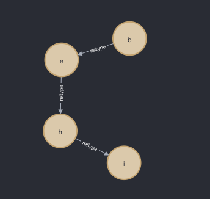
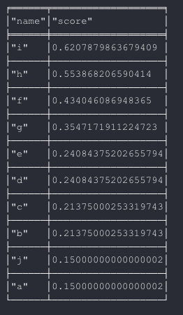

# Create objects neo4j
```neo4j
create (ab:city { name: "a"});
create (ab:city { name: "b"});
create (ab:city { name: "c"});
create (ab:city { name: "d"});
create (ab:city { name: "e"});
create (ab:city { name: "f"});
create (ab:city { name: "g"});
create (ab:city { name: "h"});
create (ab:city { name: "i"});
create (ab:city { name: "j"});
create (ab:city { name: "k"});
```

# Query all nodes types person and return the names
```neo4j
match(n:city) return n.name;
```


# create relationships
```neo4j
match (a:city),(b:city) where a.name = 'a' and b.name = 'b' create (a)-[r:reltype {name:'->'}]->(b);
match (a:city),(b:city) where a.name = 'a' and b.name = 'c' create (a)-[r:reltype {name:'->'}]->(b);
match (a:city),(b:city) where a.name = 'b' and b.name = 'e' create (a)-[r:reltype {name:'->'}]->(b);
match (a:city),(b:city) where a.name = 'e' and b.name = 'f' create (a)-[r:reltype {name:'->'}]->(b);
match (a:city),(b:city) where a.name = 'b' and b.name = 'd' create (a)-[r:reltype {name:'->'}]->(b);
match (a:city),(b:city) where a.name = 'd' and b.name = 'g' create (a)-[r:reltype {name:'->'}]->(b);
match (a:city),(b:city) where a.name = 'g' and b.name = 'h' create (a)-[r:reltype {name:'->'}]->(b);
match (a:city),(b:city) where a.name = 'h' and b.name = 'i' create (a)-[r:reltype {name:'->'}]->(b);
```

# Return all nodes who has a relation
```neo4j
match p=()-[r]->() where r.name='->' return p
```


# Return a specific relation
```neo4j
match p=(a:city)-[r]->(b:city) where r.name='->' and a.name='a' and b.name='b' return p;
```

# Delete a specific relation
```neo4j
match p=(a:city)-[r]->(b:city) where r.name='->' and a.name='a' and b.name='b' delete r;
```


# Add another relations

```neo4j
match (a:city),(b:city) where a.name = 'e' and b.name = 'h' create (a)-[r:reltype {name:'->'}]->(b);
match (a:city),(b:city) where a.name = 'c' and b.name = 'f' create (a)-[r:reltype {name:'->'}]->(b);
```

## Writing shortest path

```neo4j
match (a:city {name: 'd'}), (b:city {name: 'i'}),
p = shortestPath((a)-[*]-(b))
where length(p) > 1
return p;
```




#### Now to have real fun install this library  ***Graph Data Science Library***

##### create a graph
- syntax
```neo4j
CALL gds.graph.create('nameOfGraph','NodeLabel','RelationshipType')
```
- mygraph
```neo4j
CALL gds.graph.create('nameAnakinSkywalker','city','reltype')
```

##### Now implementing page rank

```neo4j
CALL gds.pageRank.stream('nameAnakinSkywalker',
    {maxIterations: 20, dampingFactor: 0.85}) YIELD nodeId, score
RETURN gds.util.asNode(nodeId).name AS name, score
ORDER BY score DESC LIMIT 10;
```




*** It could be interesting to implement dinic algorithm, feel free to pr."

